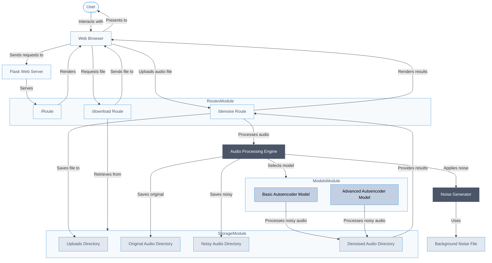
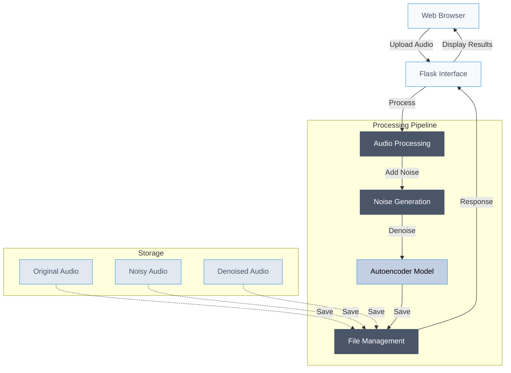

# Audio Denoising Autoencoder

A Flask-based web application that uses deep learning autoencoders to remove noise from audio files. The application supports multiple types of noise (Gaussian, White, and Background) and provides an intuitive web interface for audio processing.

## 📁 Repository Structure

```
.
├── denoising_encoder_flask/     # Main Application Directory
│   ├── app.py                  # Flask application
│   ├── Dockerfile              # Docker configuration
│   ├── requirements.txt        # Python dependencies
│   ├── models/                 # Trained ML models
│   │   ├── denoising_autoencoder.h5
│   │   └── best_autoencoder_model.h5
│   ├── assets/                 # Asset files
│   │   └── background_noise.m4a
│   ├── templates/              # HTML templates
│   │   ├── index.html
│   │   └── result.html
│   ├── uploads/               # Temporary upload directory
│   ├── original_audio/        # Original audio storage
│   ├── noisy_audio/          # Noisy audio storage
│   └── denoised_audio/       # Processed audio storage
```

## 🚀 Setup and Installation

### Prerequisites

- Docker
- Git

### Application Setup

1. Clone the repository:
```bash
git clone <repository-url>
cd denoising_encoder_flask
```

2. Build the Docker image:
```bash
docker build -t denoising-encoder .
```

3. Run the application:
```bash
docker run -p 6767:6767 \
    -v $(pwd)/uploads:/app/uploads \
    -v $(pwd)/original_audio:/app/original_audio \
    -v $(pwd)/noisy_audio:/app/noisy_audio \
    -v $(pwd)/denoised_audio:/app/denoised_audio \
    denoising-encoder
```

The web interface will be available at `http://localhost:6767`

## 🖥️ Using the Application

The web interface allows you to:
- Upload audio files (WAV format)
- Select noise type (Gaussian, White, or Background)
- Choose between basic and advanced denoising models
- Listen to original, noisy, and denoised audio
- Download processed audio files

### Supported Features

1. **Multiple Noise Types**
   - Gaussian Noise
   - White Noise
   - Background Noise

2. **Two Denoising Models**
   - Basic Autoencoder
   - Advanced Autoencoder

3. **Audio Processing**
   - Real-time audio playback
   - Download options for all audio versions
   - Automatic audio length adjustment

## 📊 Input Format

The application accepts:
- Audio files in WAV format
- Recommended duration: 2-10 seconds
- Any sample rate (automatically resampled)

## 🔍 Troubleshooting

Common issues and solutions:

1. **Docker container fails to start**
   - Check if port 6767 is available
   - Ensure model files are in the correct location
   - Verify Docker is running

2. **Audio processing errors**
   - Verify input file format is WAV
   - Check if file is corrupted
   - Ensure sufficient disk space for processing

## 📜 Application Flow




## 📝 License

This project is licensed under the MIT License - see the LICENSE file for details.
